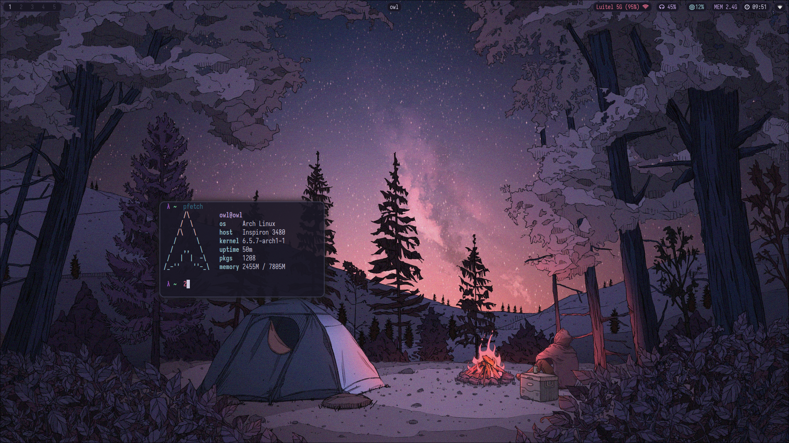
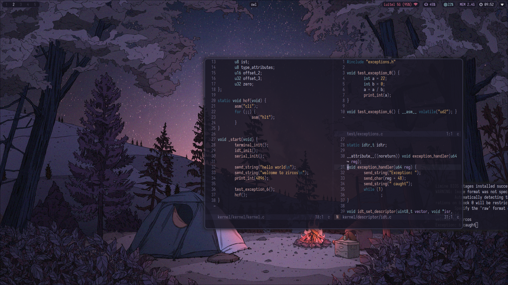

* Dotfiles


+ Linux              - [Arch](https://archlinux.org/)
+ Wayland Compositor - [Hyprland](https://aur.archlinux.org/packages/waybar-hyprland-git)
+ Font               - [Iosevka](https://github.com/be5invis/Iosevka)
+ Terminal           - [Foot](https://codeberg.org/dnkl/foot)
+ Launcher           - [Bemenu](https://github.com/Cloudef/bemenu)
+ File Manager       - [Nnn](https://github.com/jarun/nnn)
+ Editor             - [Helix](https://helix-editor.com/)
+ Notification       - [Mako](https://github.com/emersion/mako)
+ Media player       - [Mpv](https://mpv.io/)
+ Pdf                - [Zathura](https://pwmt.org/projects/zathura/)
+ Other things I might never use but its there incase anything goes wrong.


Remaps
```
Caps <-> Ctrl
```

main keybinds
```
SUPER+S+Ret - bemenu
M+RET       - foot
```

aliases
```
n = nnn
v = helix
```
